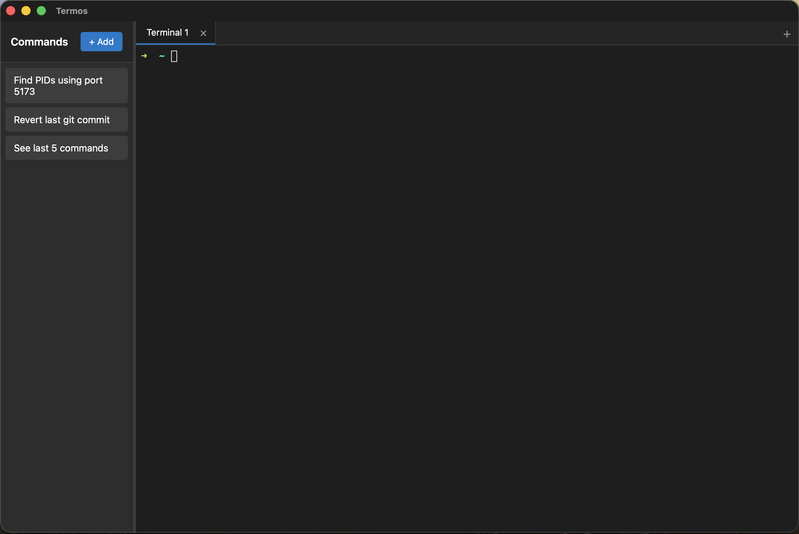
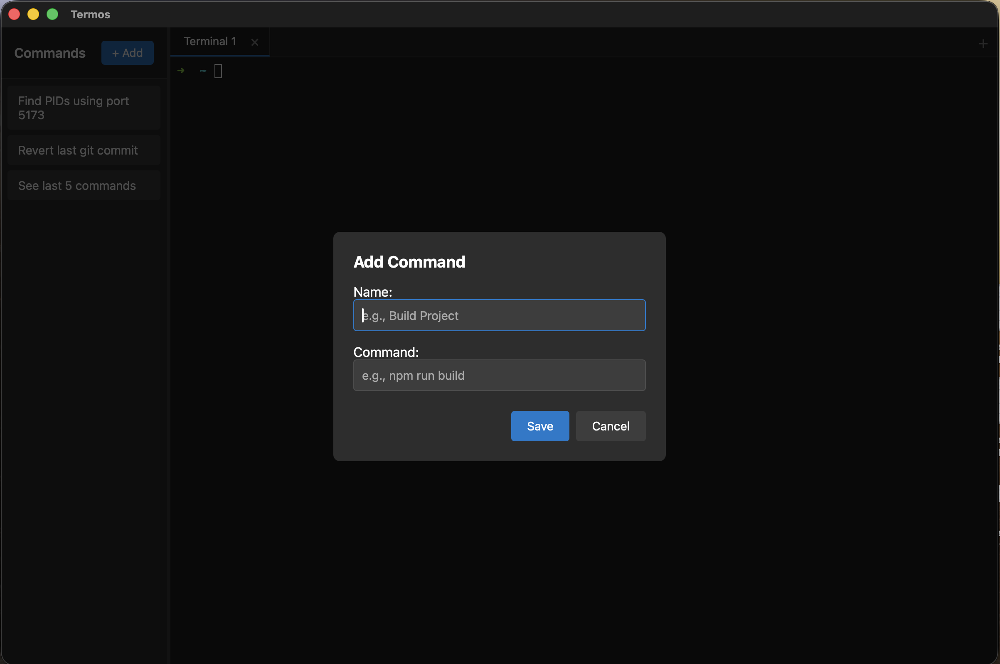
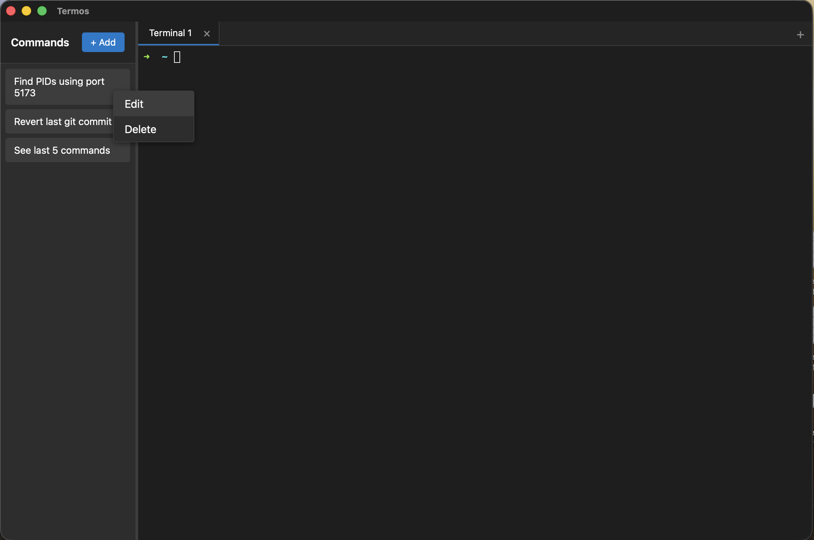

# Termos

A terminal application with configurable command buttons for commonly used commands.


## Screenshots

The default view when opening the application.



Create a custom command that becomes a button



Edit existing commands



## Features

- Interactive terminal with xterm.js and native PTY
- Multiple terminal tabs
- Resizable sidebar with command buttons
- Add, edit, and delete command shortcuts
- Command templates with variables (`{{variable}}` syntax)
- Local storage persistence
- Context menus and modal dialogs
- Cross-platform (macOS, Linux, Windows)

## Tech Stack

- **Backend**: Rust + Tauri
- **Frontend**: React + TypeScript + styled-components
- **Terminal**: xterm.js with fit addon
- **Build**: Vite

## Prerequisites

- Node.js 18+
- Rust 1.70+
- System dependencies for Tauri: https://tauri.app/v1/guides/getting-started/prerequisites

## Running the App

```bash
npm install       # Install frontend dependencies (first time)
cargo tauri dev   # Start development server
```

## Building for Production

```bash
cargo tauri build
```

This creates a native application bundle in `target/release/bundle/`

## Keyboard Shortcuts

| Shortcut     | Action          |
| ------------ | --------------- |
| Cmd/Ctrl+T   | New tab         |
| Cmd/Ctrl+W   | Close tab       |
| Cmd/Ctrl+K   | Command palette |

## Command Templates

Commands support template variables using double curly braces. When you run a command with variables, a modal will prompt you for the values.

Example: `docker exec -it {{container}} bash`

## Project Structure

```text
termos/
├── src/                    # React frontend
│   ├── components/         # Reusable styled-components
│   ├── views/              # Feature components
│   ├── layouts/            # Layout components
│   ├── hooks/              # Custom React hooks
│   └── utils/              # Utility functions
├── src-tauri/              # Rust backend
│   └── src/
│       ├── main.rs         # PTY management
│       └── lib.rs          # Data structures
└── dist/                   # Build output
```

## How It Works

### Backend (Rust)

- Creates a PTY (pseudo-terminal) using `portable-pty`
- Spawns a shell (zsh/bash)
- Reads output from the PTY and sends to frontend via Tauri events
- Receives input from frontend and writes to PTY

### Frontend (React)

- Uses xterm.js for terminal rendering
- Communicates with Rust backend via Tauri's invoke/event system
- Manages button state in localStorage
- Handles UI interactions (modals, context menus, resizing)

## Storage

- `localStorage["termos-buttons"]` - Command buttons JSON
- `localStorage["termos-sidebar-width"]` - Sidebar width

## Future Enhancements

- [x] Multiple terminal tabs
- [ ] Custom themes
- [ ] Command history search
- [ ] Button groups/categories
- [ ] Export/import configurations
